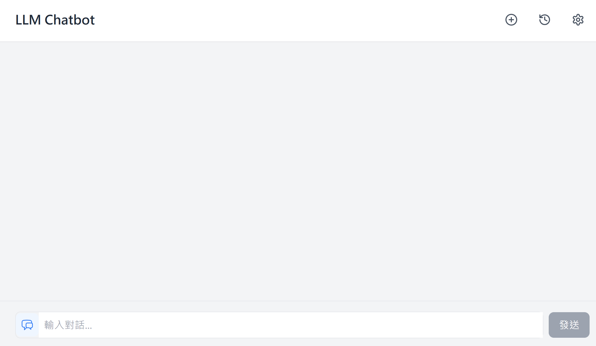
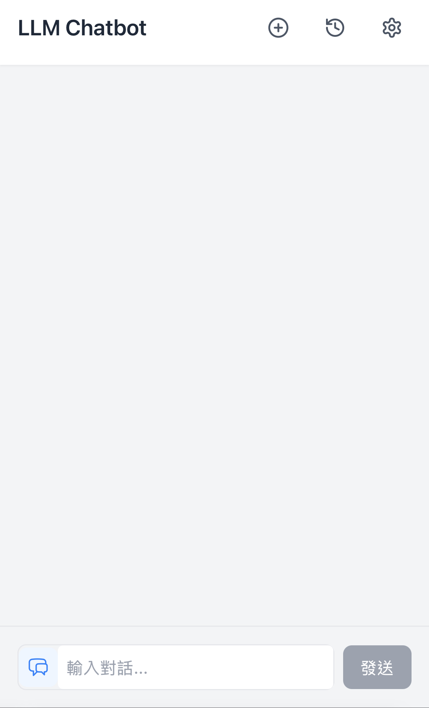
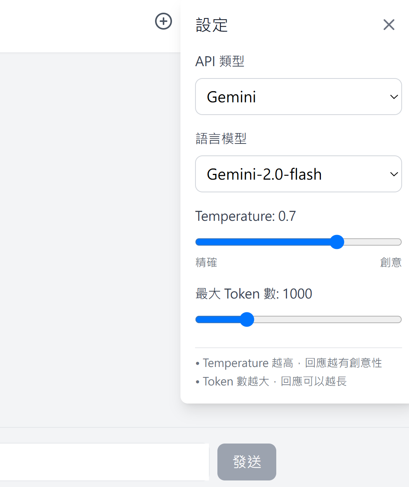
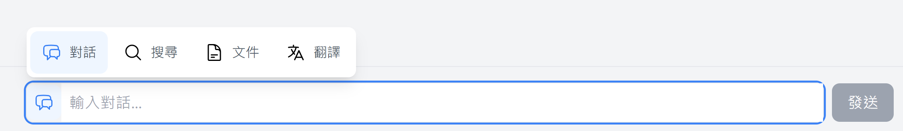
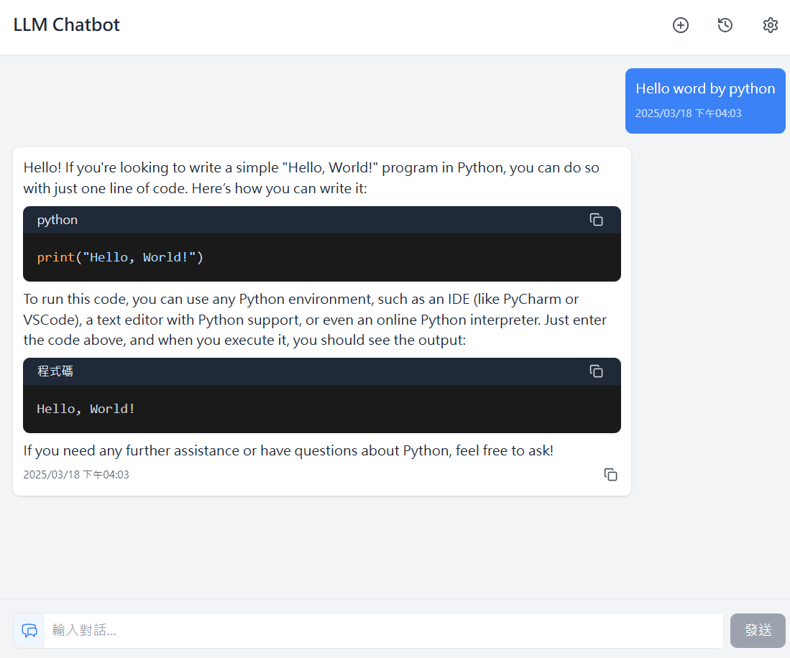
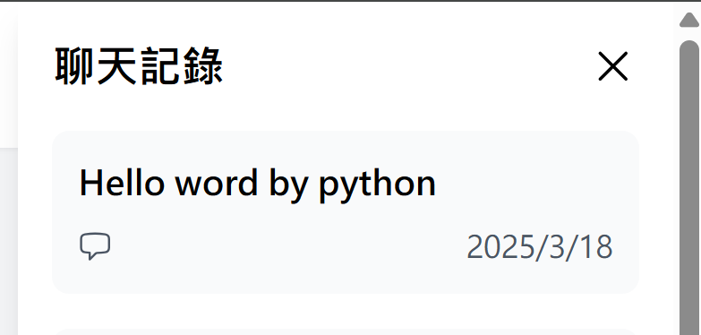
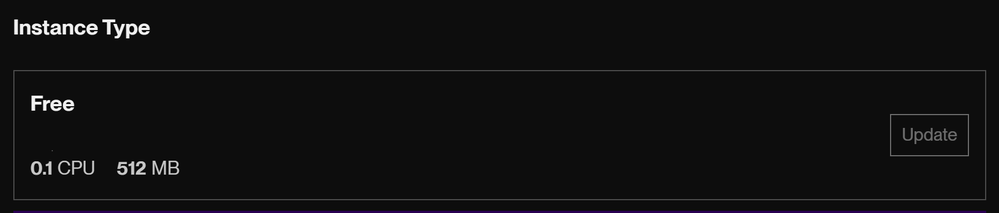
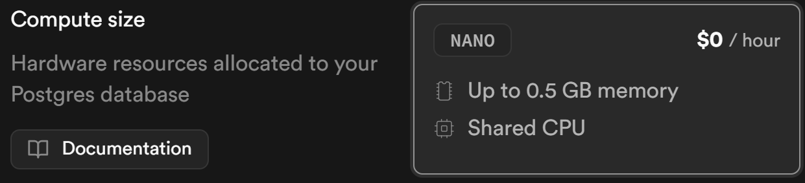

# LLM Chatbot

這是一個由大型語言模型驅動的聊天機器人應用，提供流暢的使用者界面與 AI 助手互動。

✨ 功能特色：  
🗨️ 對話式 AI – 動態且具吸引力的交互體驗  
🌐 即時翻譯 – 順暢的多語言溝通  
📰 文章摘要 – 快速提取內容重點  


🛠️ 技術棧：  
💻 前端：React – 打造直觀的用戶界面  
⚙️ 後端：FastAPI – 設計高效的非同步 API  
🗄️ 數據庫：PostgreSQL – 管理結構化數據  
🐳 容器化：Docker – 確保一致的環境  
☁️ 部署：Render + Docker & Supabase + PostgreSQL – 雲端解決方案  

## 截圖
### 自適應畫面
- Computer


- Mobile


- Setting


- Task


- Code block & Format


- History


## 系統架構

### 前端架構

**技術棧：**
- **框架**：React 18
- **樣式**：Tailwind CSS
- **構建工具**：Vite
- **HTTP 客戶端**：Axios

**核心組件：**
- **ChatInterface**：主要聊天界面
- **MessageList**：訊息顯示區域
- **InputArea**：用戶輸入區域
- **Settings**：用戶設定面板
- **ChatHistory**：歷史對話記錄
- **CodeBlock**：代碼顯示組件

**自定義 Hooks：**
- **useChatState**：管理聊天狀態
- **useMessageHandlers**：處理消息相關邏輯
- **useBackendStatus**：監控後端狀態
- **useVectorDB**：向量數據庫操作

### 後端架構

**技術棧：**
- **框架**：FastAPI
- **ORM**：SQLAlchemy
- **數據庫**：PostgreSQL/SQLite
- **AI 整合**：OpenAI API、Google Gemini API、OpenRouter API
- **向量數據庫**：支援文檔檢索功能

**API 路由：**
- **/chat**：處理對話請求
- **/history**：管理歷史對話記錄
- **/logs**：系統日誌查詢
- **/vectordb**：向量數據庫操作
- **/health**：系統健康檢查

### 部署架構

**容器化：**
- 使用 Docker 和 Docker Compose 進行容器編排
- 前後端分別使用獨立的容器

**雲端部署方案：**
- **伺服器**：Render + Docker
- **數據庫**：Supabase + PostgreSQL (免費 8GB 方案)

## 配置文件說明
### 後端配置
- `requirements.txt`: Python 依賴包清單
- `Dockerfile`: 後端容器化配置

### 前端配置
- `package.json`: npm 包管理和腳本配置
- `vite.config.js`: Vite 開發服務器配置
- `tailwind.config.js`: Tailwind CSS 框架配置
- `postcss.config.js`: PostCSS 處理器配置
- `Dockerfile`: 前端容器化配置

### 根目錄配置
- `docker-compose.yml`: 多容器應用編排配置
- `.env`: 環境變數配置文件

## 功能說明

### 前端功能

#### 核心聊天功能
- 即時聊天界面與訊息顯示
- 支援 Markdown 和程式碼高亮
- 訊息複製功能
- 載入中狀態顯示

#### 設定功能
- 模型選擇 (OpenAI, Gemini, OpenRouter)
- 溫度參數調整
- 最大 Token 設定
- API 類型切換

#### 歷史紀錄
- 查看過往對話
- 分頁載入歷史對話
- 切換不同用戶的對話記錄

#### 向量數據庫整合
- 上傳文檔功能
- 文檔檢索顯示

### 後端功能

#### 聊天處理
- 支援多種大型語言模型 API
- 流式回應處理
- 上下文管理
- 系統提示詞設定

#### 數據存儲
- 對話紀錄持久化
- 用戶會話管理
- 向量數據儲存與檢索

#### 日誌與監控
- 系統日誌記錄
- API 調用監控
- 錯誤處理與回報

## 線上部屬方案
### 伺服器
- Render + Docker


### 資料庫
- Supabase + PostgreSQL(Free-8GB)


## 資料庫設計

### 關係型資料庫

**Chat 表**
- `id`: 主鍵
- `session_id`: 會話識別碼
- `turn_id`: 對話回合識別碼
- `user_id`: 用戶識別碼
- `user_message`: 用戶訊息內容
- `assistant_message`: 助手回應內容
- `timestamp`: 時間戳

### 向量資料庫
- 用於存儲文檔向量嵌入
- 支援語義搜索功能

## API 接口說明

### 聊天相關

#### POST /chat/
- **功能**：創建新的聊天對話
- **參數**：
  - `message`: 使用者訊息
  - `session_id`: 會話 ID
  - `user_id`: 用戶 ID
  - `model`: 使用的模型
  - `temperature`: 溫度參數
  - `max_tokens`: 最大 Token 數
  - `api_type`: API 類型 (openai/gemini/openrouter)
  - `context`: 對話上下文
  - `prompt`: 系統提示詞
- **返回**：流式回應的聊天內容

### 歷史紀錄相關

#### GET /history/
- **功能**：獲取歷史對話記錄
- **參數**：
  - `user_id`: 用戶 ID
  - `offset`: 分頁偏移
  - `limit`: 每頁數量
- **返回**：對話記錄列表

#### GET /history/{session_id}
- **功能**：獲取特定會話的對話記錄
- **參數**：
  - `session_id`: 會話 ID
- **返回**：該會話的對話記錄

### 向量數據庫相關

#### POST /vectordb/add/
- **功能**：添加文檔到向量數據庫
- **參數**：
  - `session_id`: 會話 ID
  - `documents`: 文檔內容列表
- **返回**：添加結果

#### POST /vectordb/retrieve/
- **功能**：檢索與查詢相關的文檔
- **參數**：
  - `session_id`: 會話 ID
  - `query`: 搜索查詢
- **返回**：相關文檔列表

## 專案結構說明
```
.
├── backend/                                        # 後端專案目錄
│   ├── database.py                                     # 數據庫配置
│   ├── Dockerfile                                      # 後端 Docker 配置文件
│   ├── main.py                                         # 主應用程序入口
│   ├── models.py                                       # 數據模型定義
│   ├── requirements.txt                                # Python 依賴清單
│   ├── routes/                                     # 各路由
│   │   ├── chat_routes.py                              # /Chat LLM 對話相關
│   │   ├── health_routes.py                            # 檢查存活
│   │   ├── history_routes.py                           # 歷史對話紀錄查詢
│   │   └── log_routes.py                               # 系統紀錄查詢
│   ├── tests/                                      # 測試目錄
│   │   ├── conftest.py                                 # 測試配置文件
│   │   └── test_main.py                                # 主要測試文件
│   ├── utils/                                      # 副程式
│   │   ├── dependencies.py                             # 資料庫連結
│   │   └── logging.py                                  # 系統紀錄管理
│
├── frontend/                                       # 前端專案目錄
│   ├── Dockerfile                                      # 前端 Docker 配置文件
│   ├── index.html                                      # HTML 模板
│   ├── package.json                                    # npm 配置文件
│   ├── postcss.config.js                               # PostCSS 配置
│   ├── public/                                     # 靜態資源目錄
│   │   └── chat-logo.svg                               # 標籤圖示
│   ├── src/                                        # 程式碼目錄
│   │   ├── App.jsx                                     # 主要的 App 元件
│   │   ├── components/                             # 元件目錄
│   │   │   ├── ChatInterface/                      # ChatInterface 元件目錄
│   │   │   │   ├── ChatHistory.jsx                     # 聊天歷史元件
│   │   │   │   ├── FeatureMenu.jsx                     # 功能選單元件
│   │   │   │   ├── Header.jsx                          # 頁面頂部元件
│   │   │   │   ├── hooks/                          # 自定義 Hooks 資料夾   
│   │   │   │   │   ├── useBackendStatus.js             # 監控後端狀態的 Hook
│   │   │   │   │   ├── useChatState.js                 # 管理聊天狀態的 Hook
│   │   │   │   │   └── useMessageHandlers.js           # 處理訊息相關邏輯的 Hook
│   │   │   │   ├── index.jsx                           # 主要的 ChatInterface 元件
│   │   │   │   ├── InputArea.jsx                       # 輸入區域元件   
│   │   │   │   ├── Message/                        # 聊天訊息相關元件
│   │   │   │   │   ├── CodeBlock.jsx                   # 程式碼塊元件
│   │   │   │   │   ├── index.jsx                       # Message 元件的入口
│   │   │   │   │   └── MessageContent.jsx              # 訊息內容元件
│   │   │   │   ├── MessageList.jsx                     # 訊息列表元件
│   │   │   │   └── Settings.jsx                        # 設定元件
│   │   │   └── ErrorBoundary.jsx                       # 錯誤相關元件
│   │   ├── config/
│   │   │   └── chat.js                                 # 聊天設定
│   │   ├── contexts/
│   │   │   └── ThemeContext.jsx                        # 主題上下文
│   │   ├── index.css                                   # 全局樣式  
│   │   ├── main.jsx                                    # 主要的 App 元件
│   │   ├── services
│   │   │   └── api.js                                  # API 服務
│   │   ├── store
│   │   │   └── index.js                                # 全局狀態管理
│   │   ├── types
│   │   │   └── chat.ts                                 # 類型定義
│   │   └── utils   
│   │       └── dateTime.js                             # 日期時間工具
│
├── docker-compose.yml                                  # Docker Compose 配置文件
├── .env                                                # 環境變數配置
├── test.db                                             # 測試數據庫 
└── README.md                                           # 專案說明文件
```

## 安裝說明

### 使用 Docker（推薦）

1. 確保已安裝 Docker 和 Docker Compose
2. 複製專案並進入目錄
```bash
git clone [專案網址]
cd [專案目錄]
```

3. 啟動服務
```bash
docker-compose up -d
```

4. 重新打包
```bash
docker-compose build --no-cache
```

### 手動安裝

#### 後端設置
1. 進入後端目錄
```bash
cd backend
```

2. 建立虛擬環境
- venv
```bash
python -m venv venv
source venv/bin/activate  # Linux/Mac
venv\Scripts\activate     # Windows
```
- uv
```
uv venv .venv
source .venv/bin/activate  # Linux/macOS
.venv\Scripts\activate     # Windows
```

3. 安裝依賴
```bash
pip install -r backend/requirements.txt
# or
uv pip install -r backend/requirements.txt
```

4. 啟動服務
```bash
uvicorn main:app --host 0.0.0.0 --port 8000
```

#### 前端設置
1. 進入前端目錄
```bash
cd frontend
```

2. 安裝依賴
```bash
npm install
```

3. 啟動開發服務器
```bash
npm run dev
```

## 環境變數設置

建立 `.env` 檔案並設置以下變數：

```env
OPENAI_API_KEY=你的OpenAI API金鑰
GOOGLE_API_KEY=你的Google API金鑰
```

### 必要環境變數
- `OPENAI_API_KEY`: OpenAI API 金鑰
- `GOOGLE_API_KEY`: Google Gemini API 金鑰
- `DATABASE_URL`: 數據庫連接字符串（生產環境）

### 可選環境變數
- `LOG_LEVEL`: 日誌級別（默認 INFO）
- `OPENROUTER_API_KEY`: OpenRouter API 金鑰（如使用）

## 使用說明

1. 開啟瀏覽器訪問 `http://localhost:5173`
2. 在底部輸入框輸入訊息
3. 按下發送按鈕或按 Enter 鍵發送訊息
4. 等待 AI 助手回應
5. 點擊右上角歷史記錄圖標可查看過往對話

## 維護與監控

### 日誌查看
- 後端日誌目錄：`backend/logs/`
- 容器日誌：`docker-compose logs -f`

### 健康檢查
- 訪問 `http://[服務地址]/health` 檢查系統狀態

### 數據庫維護
- 定期備份數據庫
- 監控數據庫空間使用情況

## 開發說明

### 測試
運行後端測試：
```bash
cd backend
python -m pytest tests/ -v
```

### API 文檔
啟動後端服務後，訪問 `http://localhost:8000/docs` 查看 API 文件

## 擴展與優化建議

### 性能優化
- 實現緩存機制減少 API 調用
- 優化數據庫查詢效能

### 功能擴展
- 增加用戶認證與授權功能
- 實現多租戶支持
- 增強向量數據庫功能（支持更多檔案類型）

### 安全加強
- 實現 API 速率限制
- 加強前端輸入驗證
- 實現數據加密存儲

## 常見問題與解決方案

### API 連接問題
- 檢查 API 密鑰配置
- 檢查網絡連接和防火牆設置

### 數據庫連接問題
- 驗證數據庫連接字符串
- 檢查數據庫服務是否運行

### 容器部署問題
- 檢查 Docker 日誌
- 確保端口映射正確設置

## 技術債與未來規劃

### 已知技術債
- 需要優化前端狀態管理
- 加強錯誤處理機制
- 改進移動端適配

### 未來規劃
- 支持更多大型語言模型
- 實現用戶訂閱與計費功能
- 開發管理後台

## 注意事項

- 確保 OpenAI API 可用
- 預設使用 SQLite 數據庫，無需額外配置
- 開發環境下前端預設監聽 5173 端口
- 後端 API 預設監聽 8000 端口